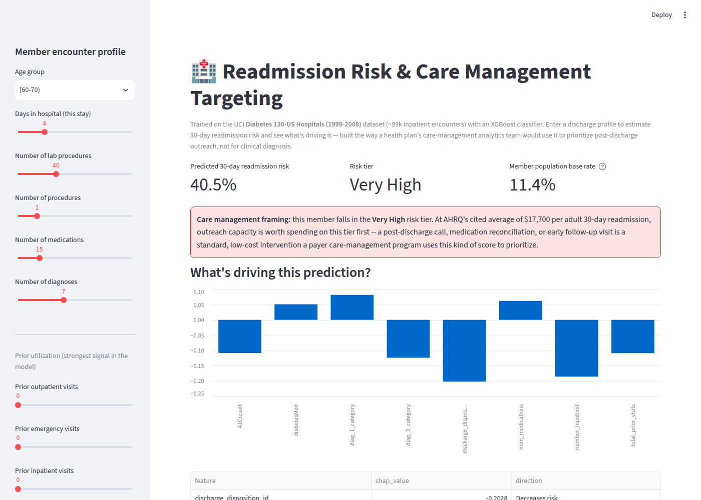
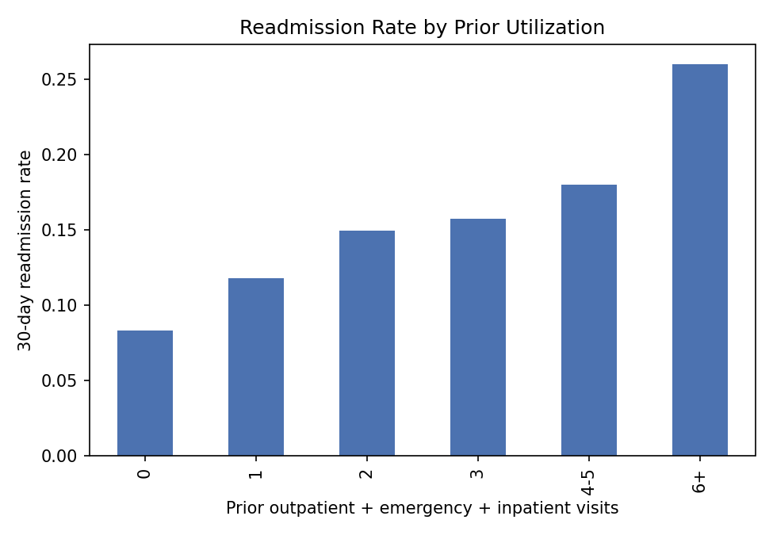
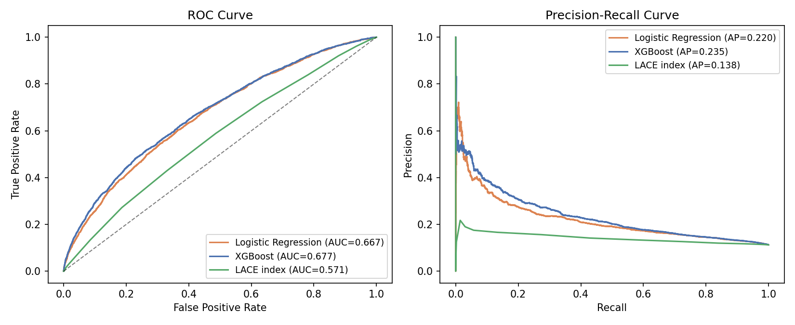
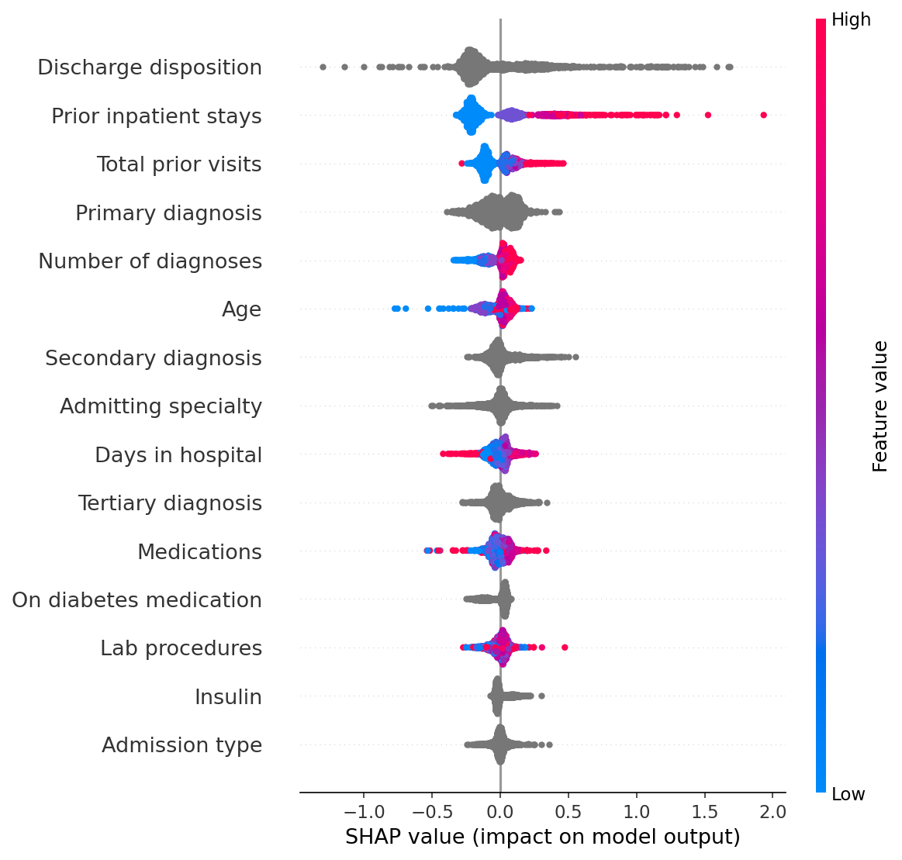

# 30-Day Readmission Risk — Health Plan Care Management Model

A full-pipeline risk model built the way a health plan's population-health
or care-management analytics team would build it: predicts which recently
discharged diabetic members are likely to be readmitted within 30 days,
with a patient-level (leakage-safe) evaluation, a fairness check, SHAP
explainability, and an interactive Streamlit demo for a care-management
targeting workflow.


**[Live demo →](#running-the-demo)** &nbsp;|&nbsp; **[Notebook →](notebooks/01_eda_and_modeling.ipynb)**





## The business problem

Unplanned readmissions are one of the most expensive, most preventable-adjacent
categories of medical spend a health plan carries — and one of the few a
payer can actually act on before the cost hits, by knowing who to reach
first. A care-management team can't call every recently discharged member;
this model scores each discharge so limited outreach capacity (a call,
medication reconciliation, an early follow-up visit) goes to the members
most likely to bounce back within 30 days. It's the same underlying signal
CMS's Hospital Readmissions Reduction Program (HRRP) financially penalizes
*hospitals* on — which is exactly why payers and provider systems both
build this kind of model, from opposite sides of the same incentive.

## Dataset

[**Diabetes 130-US Hospitals for Years 1999–2008**](https://doi.org/10.24432/C5230J)
(Clore, Cios, DeShazo & Strack, 2014; UCI ML Repository, CC BY 4.0),
101,766 inpatient encounters for diabetic patients across 130 US hospitals.
After excluding encounters that ended in death or hospice discharge (which
cannot be meaningfully "readmitted") and 3 rows with an unrecorded gender:
**99,340 encounters, 69,987 unique patients**. Target: readmission within 30
days (**11.4%** base rate after cleaning).

## Two choices this project is deliberate about

Most portfolio versions of this dataset get these wrong, so they're worth
calling out explicitly:

1. **Patient-level train/test split.** ~30% of patients in this dataset have
   more than one encounter. A random row-level split lets the same patient's
   encounters leak across train and test, inflating apparent accuracy. This
   pipeline splits on `patient_nbr` (`GroupShuffleSplit`) instead, and
   asserts the split is leakage-free before training.
2. **Race is excluded from the model's features.** It's genuinely predictive
   in this data — as it is in most US healthcare data, reflecting structural
   inequities rather than biology — but training a clinical risk score that
   allocates care-management resources directly on race risks encoding
   discrimination into the tool. It's kept out of `X` and instead used for a
   post-hoc fairness check (below).

## Approach

1. **Clean & engineer** (`src/data_prep.py`) — drop near-empty columns
   (weight is 97% missing), impute/flag the rest, collapse ICD-9 diagnosis
   codes into 9 clinical categories (circulatory, diabetes, respiratory, …,
   following Strack et al.'s original grouping), and engineer prior-utilization
   and medication-change features.
2. **Model, champion vs. challenger** (`src/train.py`) — class-weighted
   logistic regression baseline vs. XGBoost with native categorical support,
   evaluated on the patient-level held-out split.
3. **Evaluate for the actual use case** — ROC-AUC/PR-AUC, plus top-decile and
   top-quintile capture rate: what share of real readmissions get caught if
   a care team can only follow up with the riskiest 10–20% of discharges.
4. **Check fairness before anything else** — error rates and predicted-positive
   rates broken out by race subgroup, even though race isn't a model input.
5. **Explain every score** — SHAP values, surfaced per-patient in the demo app.

## Results

Evaluated on a held-out, patient-level 25% test split (24,757 encounters,
no patient overlap with train):

| Model | ROC-AUC | PR-AUC |
|---|---|---|
| Logistic Regression (baseline) | 0.668 | 0.220 |
| **XGBoost** | **0.675** | **0.232** |

**An AUC of ~0.68 is the honest result here, not a shortcoming to explain
away.** Predicting a 30-day readmission from encounter data alone is a
genuinely hard problem — it depends heavily on factors this dataset simply
doesn't capture (housing stability, caregiver support, medication adherence
after discharge). Published academic and applied analyses of this exact
dataset land in the same 0.65–0.70 range; a model claiming 0.90+ here would
be the signal something leaked, not that it's better.

What matters for the actual use case is ranking, not raw discrimination:

- **Flagging the riskiest 10% of discharges catches 25% of all 30-day readmissions.**
- **Flagging the riskiest 20% catches 40%.**

That's the number a care-management team sizing a follow-up-call program
would actually use.



### What that's worth in payer terms

AHRQ's Healthcare Cost and Utilization Project puts the **average cost of an
adult 30-day readmission at $17,700** (2020 Nationwide Readmissions
Database; [HCUP Statistical Brief #307](https://hcup-us.ahrq.gov/reports/statbriefs/sb307-readmissions-2020.jsp)).
Applying that to this test set alone (24,757 discharges, 2,789 actual
30-day readmissions) reframes the capture-rate numbers above as cost
concentration, not just model accuracy:

| Outreach targets | Discharges reviewed | Readmissions captured | Cost exposure captured |
|---|---|---|---|
| Top 10% by risk score | 2,476 | 705 | ≈ $12.5M |
| Top 20% by risk score | 4,951 | 1,125 | ≈ $19.9M |
| All 2,789 readmissions | 24,757 | 2,789 | ≈ $49.4M |

In other words: a care-management program that can only reach a fifth of
discharged members still gets in front of 40% of the total cost exposure —
which is the pitch a payer-side data science team actually has to make to
get outreach headcount funded. (This is cost *exposure* the flagged
population represents, not a claim about dollars an intervention would
save — that requires an actual program-effectiveness study, not a model.)

SHAP shows prior inpatient visits, discharge disposition, and primary
diagnosis category dominate the prediction — consistent with both clinical
intuition and the EDA.



### Fairness check

Race is not a model feature, but error rates were checked across race
subgroups post-hoc (`models/metrics.json`). Recall and predicted-positive
rate move together reasonably closely across groups (more noise in the
smaller ones, as expected from sample size alone), and per-group AUC stays
in a similar band to the overall model — not a substitute for a full audit
before any real deployment, but the kind of check that should run before a
model like this goes near a live workflow.

Full narrative, additional EDA, and every chart above (regenerated from
scratch, not screenshots) live in
[`notebooks/01_eda_and_modeling.ipynb`](notebooks/01_eda_and_modeling.ipynb).

## Running the demo

```bash
git clone <this-repo>
cd healthcare-readmission
python -m venv .venv && source .venv/bin/activate
pip install -r requirements.txt

# Reproduce data cleaning, training, evaluation, and all figures:
python -m src.train

# Launch the interactive risk dashboard:
streamlit run app.py
```

The app takes a discharge profile (prior utilization, length of stay,
diagnosis category, medications, etc.), returns a 30-day readmission risk
estimate, a risk tier for care-management targeting, and the top SHAP
factors behind that specific prediction.

## Project structure

```
├── app.py                     # Streamlit demo
├── src/
│   ├── data_prep.py           # cleaning + feature engineering (shared by training & app)
│   └── train.py                # patient-level split, trains both models, evaluates, fairness check
├── notebooks/
│   └── 01_eda_and_modeling.ipynb
├── data/reference/
│   └── ids_mapping.csv        # admission/discharge code -> description lookup
├── models/                    # trained model artifacts + metrics.json (generated)
├── reports/figures/           # evaluation charts (generated)
├── tests/                     # unit tests for the data pipeline
└── requirements.txt
```

## Notes & limitations

This is a portfolio project on public research data (1999–2008, 130 US
hospitals), not a validated clinical or actuarial tool. A real deployment on
a health plan's book of business would need: prospective validation on
current data (care patterns and cost trends have shifted substantially since
2008), a full fairness/bias audit beyond the subgroup check above,
integration with data this dataset doesn't have (claims history and cost
data instead of a single-encounter snapshot, social determinants of health,
pharmacy fill data, post-discharge follow-up records), and sign-off from
clinical, actuarial, and compliance review before it touches a live
care-management or utilization-management workflow.

## License

MIT — see [LICENSE](LICENSE). Dataset used under its original CC BY 4.0
license; see [`data/reference/ids_mapping.csv`](data/reference/ids_mapping.csv)
for the source code mappings and the dataset DOI above for full attribution.
