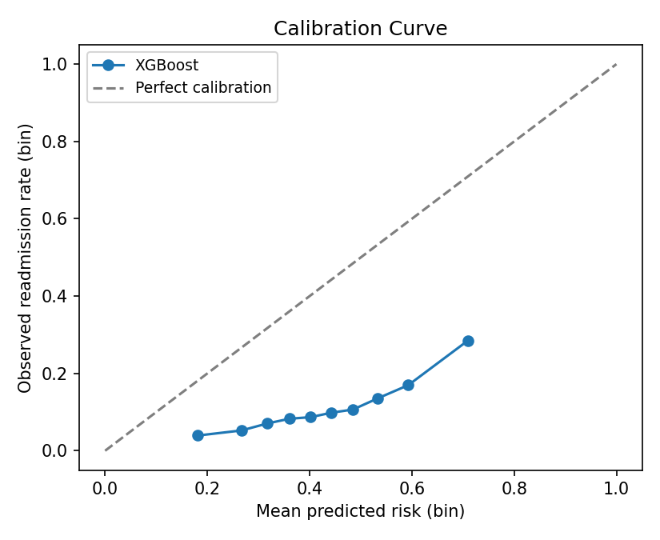
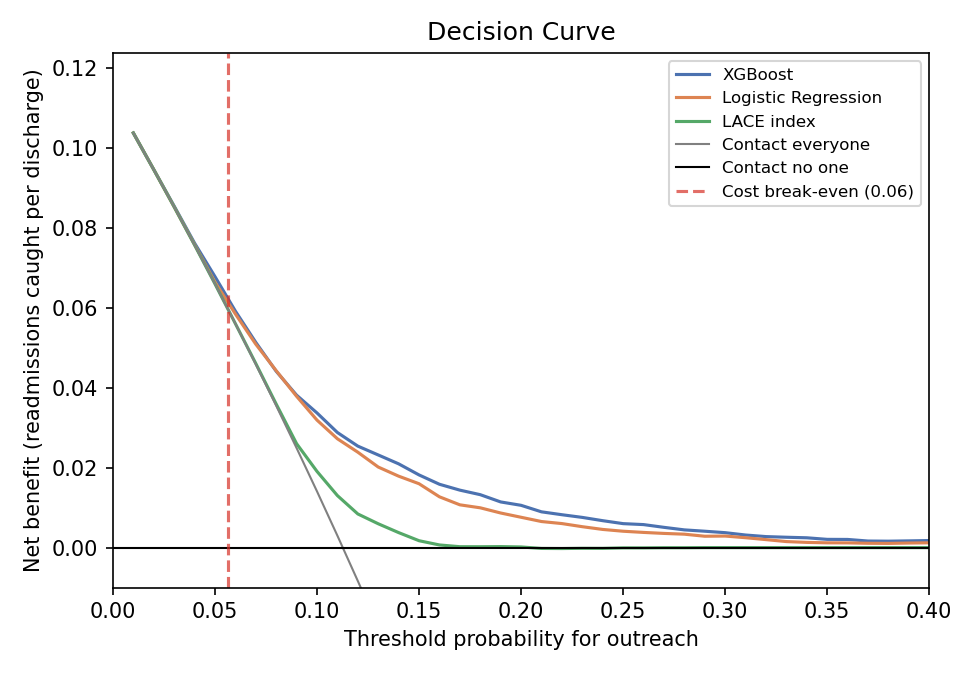
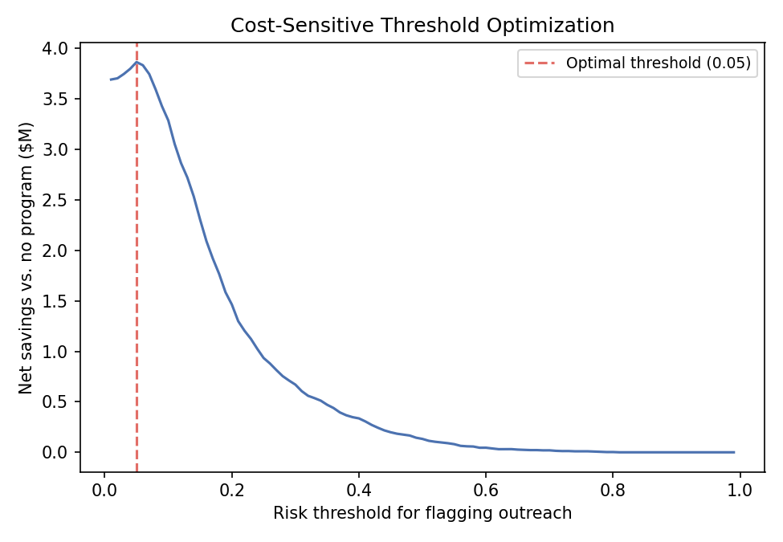

# 30-Day Readmission Risk: Health Plan Care Management Model

A full-pipeline risk model built the way a health plan's population-health
or care-management analytics team would build it. It predicts which
recently discharged diabetic members are likely to be readmitted within 30
days, so a care-management team with limited capacity knows who to call
first, and it comes with an interactive Streamlit demo for that workflow.

[](https://github.com/jlwj22/Healthcare-Readmission/actions/workflows/ci.yml)


**[Run the demo →](#running-the-demo)** &nbsp;|&nbsp; **[Notebook →](notebooks/01_eda_and_modeling.ipynb)** &nbsp;|&nbsp; **[Model card →](MODEL_CARD.md)**

## Key results

- **Beats the clinical standard.** ROC-AUC 0.677 vs. 0.571 for the LACE
  index hospitals already use. Flagging the riskiest 20% of discharges
  catches **40% of 30-day readmissions** (LACE: 28%).
- **Probabilities you can put a dollar figure on.** Predicted risk averages
  11.2% against an observed 11.3%, after a calibration check caught class
  weighting inflating every probability about fourfold.
- **Leakage-safe, with error bars.** Patient-level train/test split, and
  95% confidence intervals on every headline number from a bootstrap that
  resamples patients.
- **Tied to a decision, not just a metric.** Decision curve and cost
  analysis show where outreach pays for itself: above about 5.6% risk
  under base-case cost assumptions.
- **Checked across groups.** Calibration and recall hold up across race,
  age, and sex at a shared outreach cutoff; weaker ranking for members 80+
  is called out rather than hidden.


## The business problem

Unplanned readmissions are one of the most expensive, most
preventable-adjacent categories of medical spend a health plan carries, and
one of the few a payer can actually act on before the cost hits, just by
knowing who to reach first. A care-management team can't call every
recently discharged member, so this model scores each discharge so that
limited outreach capacity (a call, medication reconciliation, an early
follow-up visit) goes to the members most likely to bounce back within 30
days. It's the same underlying signal CMS's Hospital Readmissions Reduction
Program (HRRP) financially penalizes hospitals on, which is exactly why
payers and provider systems both build this kind of model, just from
opposite sides of the same incentive.

## Dataset

[**Diabetes 130-US Hospitals for Years 1999-2008**](https://doi.org/10.24432/C5230J)
(Clore, Cios, DeShazo & Strack, 2014; UCI ML Repository, CC BY 4.0),
101,766 inpatient encounters for diabetic patients across 130 US hospitals.
After excluding encounters that ended in death or hospice discharge (which
can't meaningfully be "readmitted") and 3 rows with an unrecorded gender,
that leaves **99,340 encounters, 69,987 unique patients**. Target:
readmission within 30 days, an **11.4%** base rate after cleaning.

## A few choices this project is deliberate about

Most portfolio versions of this dataset get at least one of these wrong, so
they're worth calling out directly instead of just doing them quietly.

1. **Patient-level train/test split.** About 30% of patients in this
   dataset have more than one encounter. A random row-level split lets the
   same patient's encounters leak across train and test, which inflates
   apparent accuracy. This pipeline splits on `patient_nbr`
   (`GroupShuffleSplit`) instead and asserts the split is leakage-free
   before training even starts. See the split comparison below for what
   that actually buys you.
2. **Race is excluded from the model's features.** It's genuinely
   predictive in this data, as it is in most US healthcare data, which
   reflects structural inequities rather than biology. Training a clinical
   risk score that allocates care-management resources directly on race
   risks baking that discrimination into the tool, so it's kept out of `X`
   and instead used for a post-hoc fairness check (below).
3. **The model reports calibrated probabilities, not just a ranking.** A
   payer pricing outreach against expected cost needs a number close to the
   true probability, not just a score that ranks members correctly. That's
   why neither model uses class weighting: an earlier version reweighted
   the rare positive class, which left the ranking almost unchanged but
   inflated every predicted probability about fourfold. See the
   calibration check below.
4. **It has to beat what hospitals already use.** The LACE index is the
   standard bedside readmission score, so it's computed from the same data
   and compared head to head, with a bootstrap confidence interval on the
   difference. Beating a logistic regression isn't the bar that matters.

## Approach

1. **Clean and engineer** (`src/data_prep.py`): drop near-empty columns
   (weight is 97% missing), impute and flag the rest, collapse ICD-9
   diagnosis codes into 9 clinical categories (circulatory, diabetes,
   respiratory, and so on, following Strack et al.'s original grouping),
   and engineer prior-utilization and medication-change features.
2. **Model, champion vs. challengers** (`src/train.py`): XGBoost with
   native categorical support vs. a logistic regression baseline and the
   LACE index (`src/lace.py`), all evaluated on the patient-level
   held-out split.
3. **Evaluate for the actual use case**: ROC-AUC and PR-AUC, plus
   top-decile and top-quintile capture rate, meaning what share of real
   readmissions get caught if a care team can only follow up with the
   riskiest 10-20% of discharges.
4. **Check that the probabilities themselves are trustworthy**: a
   calibration curve, Brier score, and calibration slope, since a payer
   pricing outreach or cost exposure off this model needs the predicted
   probability to actually mean what it says.
5. **Put error bars on everything**: 95% confidence intervals from a
   bootstrap that resamples patients, not encounters
   (`src/evaluation.py`), so repeat visits don't make the estimates look
   more certain than they are.
6. **Ask whether acting on it is worth it**: decision curve analysis and a
   cost-based threshold sweep, not just discrimination metrics.
7. **Check subgroups before anything else**: calibration, flag rates, and
   recall by race, age band, and sex at the same outreach cutoff, even
   though race isn't a model input.
8. **Explain every score**: SHAP values, surfaced per-patient in the demo
   app.

## Results

Evaluated on a held-out, patient-level 25% test split (24,757 encounters
from 17,497 patients, no patient overlap with train). Brackets are 95%
confidence intervals from 1,000 bootstrap resamples of test-set patients.

| Model | ROC-AUC | PR-AUC | Readmissions caught in top 20% | Brier score |
|---|---|---|---|---|
| LACE index (clinical standard) | 0.571 [0.558, 0.583] | 0.138 [0.130, 0.146] | 27.7% [26.0, 29.4] | 0.099 |
| Logistic regression | 0.667 [0.656, 0.679] | 0.220 [0.201, 0.240] | 38.6% [36.9, 40.2] | 0.096 |
| **XGBoost** | **0.677 [0.665, 0.689]** | **0.235 [0.216, 0.255]** | **40.4% [38.5, 42.3]** | **0.095** |

An AUC around 0.68 is the honest result here, not a shortcoming to explain
away. Predicting a 30-day readmission from encounter data alone is a
genuinely hard problem. It depends heavily on factors this dataset simply
doesn't capture: housing stability, caregiver support, medication adherence
after discharge. Published academic and applied analyses of this exact
dataset land in the same 0.65-0.70 range, so a model claiming 0.90+ here
would be the signal something leaked, not that the model is better.

What matters for the actual use case is ranking, not raw discrimination.

- **Flagging the riskiest 10% of discharges catches 25% of all 30-day readmissions.**
- **Flagging the riskiest 20% catches 40%.**

That's the number a care-management team sizing a follow-up-call program
would actually use.


### Does it beat the clinical standard?

Plenty of hospitals already flag readmission risk with the
[LACE index](https://doi.org/10.1503/cmaj.091117) (van Walraven et al.,
2010): points for **L**ength of stay, **A**cuity of admission,
**C**omorbidity (Charlson index), and **E**mergency department visits,
totaled to a 0-19 score. So "better than a logistic regression" isn't the
bar a new model has to clear. It has to beat the thing already in use.
`src/lace.py` computes LACE from the same encounter data, including a
Charlson comorbidity index mapped from the ICD-9 codes (Quan et al. 2005
coding).

LACE lands at a ROC-AUC of 0.571 here, and XGBoost beats it by **0.106
[0.091, 0.120]** and catches **12.7 [10.3, 15.1] more percentage points**
of readmissions in the riskiest 20% of discharges. Both intervals are well
clear of zero. Two caveats cut LACE some slack: this dataset only has three
diagnosis codes per encounter, so its Charlson score undercounts
comorbidities, and ED visits are counted over the prior year rather than
LACE's prior 6 months. LACE also wasn't built for a diabetic-only
population. Still, LACE reached a C-statistic of 0.68 in its original
derivation study and usually lands lower in external validations, so a gap
this size says the utilization history, discharge disposition, and
medication detail in this dataset carry real signal beyond what a four-item
score can pick up.

XGBoost's edge over the logistic regression is much smaller, 0.010 [0.004,
0.016] AUC, though still clear of zero. Most of the gain over LACE comes
from the richer features, not from the choice of algorithm.

### Is the model calibrated?

Ranking members correctly isn't the whole job here. If a payer wants to use
predicted risk to estimate expected cost exposure (the section below does
exactly that), the predicted probabilities need to line up with observed
outcomes, not just put the right members in the right order.



XGBoost's mean predicted risk is **11.2% against an observed 11.3%**
(observed/expected 1.00), with a calibration slope of 0.95 (1.0 is
ideal), and the curve tracks the diagonal across every decile.

That wasn't true of the first version of this model, and the check is how
it got caught. Training with `scale_pos_weight` (the usual advice for an
imbalanced target) left the ranking essentially unchanged but pushed the
mean predicted risk to **0.43**, nearly four times the real rate, so every
curve point sat far below the diagonal. For a pure ranking use case that's
harmless. For anything that multiplies a probability by a dollar amount,
like the cost analysis below, it's badly wrong. Dropping the class
weighting fixed it with no loss in AUC (0.676 → 0.677) and halved the Brier
score (0.203 → 0.095).

### Why the patient-level split actually matters

It's one thing to say a naive split leaks and another to show what that
leakage is worth. `src/train.py` also fits the identical XGBoost
architecture on a plain stratified row-level split that ignores
`patient_nbr` entirely, so the same patient can and does land in both train
and test.

| Split | ROC-AUC | PR-AUC | Test patients also seen in train |
|---|---|---|---|
| Patient-level (`GroupShuffleSplit`, used everywhere else in this project) | 0.675 | 0.232 | 0% (by construction) |
| Naive row-level (`train_test_split`, stratified on outcome only) | 0.678 | 0.235 | 35.8% |

The gap here is real but smaller than the leakage horror stories you'll
sometimes see, which is itself an interesting result. With `patient_nbr`
excluded from the feature set, the model can't directly memorize "this ID
tends to be high risk." What leaks instead is subtler: two encounters from
the same patient often share very similar demographic and clinical feature
values, so seeing one of them in training gives the model a small edge on
the other one at test time, even without ever seeing the patient ID
directly. About a third of a point of AUC doesn't sound dramatic, but on a
model this close to its ceiling, and multiplied across every metric and
report a team might build on top of it, it's exactly the kind of quiet
optimism that a good validation process is supposed to catch before it
reaches production. It's also a more honest finding than claiming the naive
split was wildly inflated: the actual answer is "modest, measurable, and
worth guarding against anyway."

SHAP shows prior inpatient visits, discharge disposition, and primary
diagnosis category dominate the prediction, consistent with both clinical
intuition and the EDA.


### What that's worth in payer terms

AHRQ's Healthcare Cost and Utilization Project puts the **average cost of an
adult 30-day readmission at $17,700** (2020 Nationwide Readmissions
Database; [HCUP Statistical Brief #307](https://hcup-us.ahrq.gov/reports/statbriefs/sb307-readmissions-2020.jsp)).
Applying that to this test set alone (24,757 discharges, 2,789 actual
30-day readmissions) reframes the capture-rate numbers above as cost
concentration, not just model accuracy:

| Outreach targets | Discharges reviewed | Readmissions captured | Cost exposure captured |
|---|---|---|---|
| Top 10% by risk score | 2,475 | 708 | ≈ $12.5M |
| Top 20% by risk score | 4,951 | 1,127 | ≈ $19.9M |
| All 2,789 readmissions | 24,757 | 2,789 | ≈ $49.4M |

In other words, a care-management program that can only reach a fifth of
discharged members still gets in front of 40% of the total cost exposure,
which is the pitch a payer-side data science team actually has to make to
get outreach headcount funded. This is the cost exposure the flagged
population represents, not a claim about dollars an intervention would
save. That requires an actual program-effectiveness study, not a model.

### Is acting on the model worth it? (decision curve)

AUC says whether the model ranks members well. It doesn't say whether
*using* it beats the obvious alternatives: call every discharged member, or
call no one. Decision curve analysis (Vickers & Elkin, 2006) answers that
directly. At each threshold probability *p*, it scores a policy by
readmissions caught per discharge, minus false alarms weighted by
*p*/(1 − *p*), the exchange rate between the two that choosing *p* implies.



| Threshold | XGBoost | Logistic regression | LACE | Contact everyone |
|---|---|---|---|---|
| 0.06 (cost break-even, below) | **0.059** | 0.058 | 0.056 | 0.056 |
| 0.10 | **0.034** | 0.032 | 0.019 | 0.014 |
| 0.15 | **0.018** | 0.016 | 0.002 | −0.044 |
| 0.20 | **0.011** | 0.008 | 0.000 | −0.109 |

Net benefit in readmissions caught per discharge. XGBoost has the highest
net benefit at nearly every threshold from 0.03 to 0.45 (logistic
regression ties it within rounding at 0.08), and its lead widens past 0.10. LACE is only useful
between roughly 0.07 and 0.15, and above 0.15 it's no better than calling
no one. Below 0.06, where outreach is cheap relative to the expected
readmission cost, every model converges on "contact nearly everyone,"
which is the same answer the cost analysis below reaches from a different
direction.

### Picking an operating threshold

The decile/quintile framing above assumes a care team that can only reach a
fixed slice of discharges. But if outreach capacity isn't the binding
constraint and cost is, `src/threshold_optimization.py` asks a different
question: at what risk threshold does flagging a discharge for outreach
actually pay for itself?

Net savings vs. doing nothing = (avoided readmission cost from flagged true
positives) − (outreach cost on everyone flagged) − (full cost on everyone
missed), swept across every threshold on the held-out test set:



At a base-case assumption of **$150 per outreach contact** and a **15%
assumed relative risk reduction** from that outreach (a scenario input, not
a validated number; a real estimate needs a program-effectiveness study),
the optimal threshold is **0.05**, flagging **86% of discharges** for a net
savings of **≈$3.9M** on this test set alone. That's a much broader net than
the top-10-20% framing above, and the reason is arithmetic, not a different
model. At $150 a call, outreach breaks even once a member's readmission risk
passes $150 / ($17,700 × 15%) ≈ **5.6%**, about half the base rate, and
most discharges clear that bar. Because the probabilities are calibrated,
the model's optimal threshold lands right on that break-even point, which
is a good sanity check in its own right. The two framings answer different
questions ("who do we reach with a fixed-size team" versus "who is it worth
reaching at all"), and it's worth showing both rather than picking
whichever one sounds better.

That optimal point moves with the assumptions, which is the point of
running it as a sensitivity analysis instead of quoting one number:

| Assumed effectiveness | Break-even risk | Optimal threshold | Discharges flagged | Net savings |
|---|---|---|---|---|
| 10% | 8.5% | 0.08 | 60% | ≈$1.7M |
| 15% (base case) | 5.6% | 0.05 | 86% | ≈$3.9M |
| 20% | 4.2% | 0.05 | 86% | ≈$6.2M |

The demo app has a live version of this (`Outreach cost-benefit simulator`)
with sliders for cost-per-outreach and assumed effectiveness, recomputed
against the same held-out predictions.

### Subgroup checks

Race is not a model feature, which is exactly why it needs checking:
leaving it out doesn't guarantee the model treats groups the same. Every
group below gets the **same** outreach cutoff (the score that marks the
riskiest 20% overall), so the question is whether one policy lands
differently on different members.

| Group | n | Observed rate | Mean predicted | ROC-AUC | Flagged | Recall |
|---|---|---|---|---|---|---|
| African American | 4,607 | 10.8% | 11.2% | 0.670 | 21.3% | 40.5% |
| Caucasian | 18,563 | 11.5% | 11.4% | 0.677 | 20.1% | 40.7% |
| Hispanic | 507 | 9.7% | 10.4% | 0.745 | 18.5% | 42.9% |
| Other | 361 | 11.1% | 10.1% | 0.688 | 13.6% | 40.0% |
| Unknown | 561 | 8.0% | 9.8% | 0.628 | 14.3% | 28.9% |
| Under 50 | 3,929 | 10.4% | 10.1% | 0.713 | 17.4% | 42.9% |
| 50-59 | 4,316 | 10.7% | 9.8% | 0.724 | 15.3% | 40.2% |
| 60-69 | 5,390 | 11.4% | 11.1% | 0.672 | 19.3% | 38.8% |
| 70-79 | 6,299 | 11.2% | 12.0% | 0.659 | 22.7% | 42.2% |
| 80+ | 4,823 | 12.4% | 12.6% | 0.623 | 23.6% | 38.4% |
| Female | 13,395 | 11.3% | 11.4% | 0.685 | 20.5% | 42.0% |
| Male | 11,362 | 11.3% | 11.1% | 0.668 | 19.4% | 38.5% |

What holds up: calibration is close for every sizable group (predicted
within about a percentage point of observed), and recall at the shared
cutoff sits around 38-43% across race, age, and sex. So a readmitted member
has a similar chance of being flagged regardless of group. What's worth
flagging: discrimination falls steadily with age (0.72 under 60 vs. 0.62
at 80+), probably because readmission among the oldest members depends
more on frailty and home support than on anything recorded here. And the
"Unknown" race group, where race wasn't recorded, has noticeably lower
recall (29%), though with only 561 encounters and about 45 readmissions
that estimate is noisy. None of this replaces a full fairness audit before
real deployment, but it's the check that should run before a model like
this goes anywhere near a live workflow.

Full narrative, additional EDA, and every chart above (regenerated from
scratch, not screenshots) live in
[`notebooks/01_eda_and_modeling.ipynb`](notebooks/01_eda_and_modeling.ipynb).

## Running the demo

```bash
git clone https://github.com/jlwj22/Healthcare-Readmission.git
cd Healthcare-Readmission
python -m venv .venv && source .venv/bin/activate
pip install -r requirements.txt

# Reproduce data cleaning, training, evaluation, and all figures:
python -m src.train

# Launch the interactive risk dashboard:
streamlit run app.py
```

Or with Docker, using the model artifacts already checked into the repo
(no training step needed):

```bash
docker compose up
# app at http://localhost:8501
```

The app takes a discharge profile (prior utilization, length of stay,
diagnosis category, medications, and so on) and returns a 30-day
readmission risk estimate, a risk tier for care-management targeting, and
the top SHAP factors behind that specific prediction.

## Project structure

```
├── app.py                         # Streamlit demo
├── MODEL_CARD.md                  # intended use, evaluation, limitations
├── src/
│   ├── data_prep.py               # cleaning + feature engineering (shared by training & app)
│   ├── lace.py                    # LACE index + Charlson comorbidity from ICD-9 codes
│   ├── evaluation.py              # decision curves, patient-level bootstrap CIs, subgroup checks
│   ├── threshold_optimization.py  # cost-sensitive outreach threshold
│   └── train.py                   # patient-level split, trains and evaluates everything
├── notebooks/
│   └── 01_eda_and_modeling.ipynb
├── data/reference/
│   └── ids_mapping.csv            # admission/discharge code -> description lookup
├── models/                        # trained models, metrics.json, test-set predictions (generated)
├── reports/figures/               # evaluation charts (generated)
├── tests/                         # unit tests
├── Dockerfile, docker-compose.yml
└── requirements.txt
```

## Notes and limitations

This is a portfolio project on public research data (1999-2008, 130 US
hospitals), not a validated clinical or actuarial tool. A real deployment
on a health plan's book of business would need prospective validation on
current data (care patterns and cost trends have shifted substantially
since 2008), a full fairness and bias audit beyond the subgroup check
above, integration with data this dataset doesn't have (claims history and
cost data instead of a single-encounter snapshot, social determinants of
health, pharmacy fill data, post-discharge follow-up records), and sign-off
from clinical, actuarial, and compliance review before it touches a live
care-management or utilization-management workflow.

## License

MIT, see [LICENSE](LICENSE). Dataset used under its original CC BY 4.0
license; see [`data/reference/ids_mapping.csv`](data/reference/ids_mapping.csv)
for the source code mappings and the dataset DOI above for full attribution.
